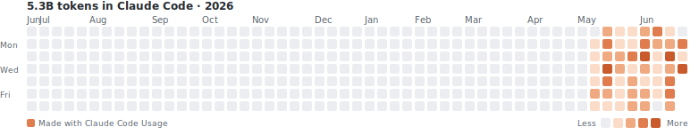

### 🔥 My Claude Code token usage

Auto-updated daily · generated locally from my own usage by the <a href="https://github.com/ClaudeCodeUsage/ClaudeCodeUsage">Claude Code Usage</a> VS Code extension · <a href="https://carl723000.github.io/Carl723000/claude-code-heatmap.svg">hover for per-day details ↗</a>

<!--
This README is my GitHub profile card; the usual profile (pins, contribution
graph, activity) still shows below it. To revert to the plain profile, delete
this repo (or empty this README).

Tooltips: GitHub renders README images as flat pictures (no hover), so the
heatmap above links to the same SVG served via GitHub Pages, where the browser
renders it natively and the per-day "N tokens on <date>" tooltips work.

The heatmap is refreshed by a local scheduled task that runs
scripts/generate-heatmap.js and pushes the updated SVG — the Claude Code logs
it reads are local, so this can't run as a cloud GitHub Action.
-->
