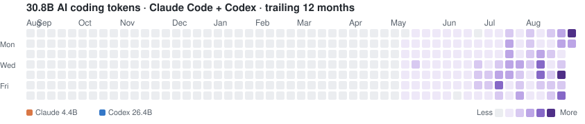

### 🔥 My Claude Code + Codex token usage

Auto-updated twice weekly · Mon + Fri · <a href="https://marketplace.visualstudio.com/items?itemName=growthjack.claude-code-usage">Track Claude Code + Codex with our VS Code extension ↗</a> · <a href="https://carl723000.github.io/Carl723000/claude-code-heatmap.svg">daily Claude + Codex details ↗</a>

<!--
This README is my GitHub profile card; the usual profile (pins, contribution
graph, activity) still shows below it. To revert to the plain profile, delete
this repo (or empty this README).

Tooltips: GitHub renders README images as flat pictures (no hover), so the
heatmap above links to the same SVG served via GitHub Pages, where the browser
renders it natively and the per-day "N tokens on <date>" tooltips work.

The heatmap is refreshed twice weekly by a local macOS LaunchAgent. Implementation
notes live in scripts/README.md.
-->
